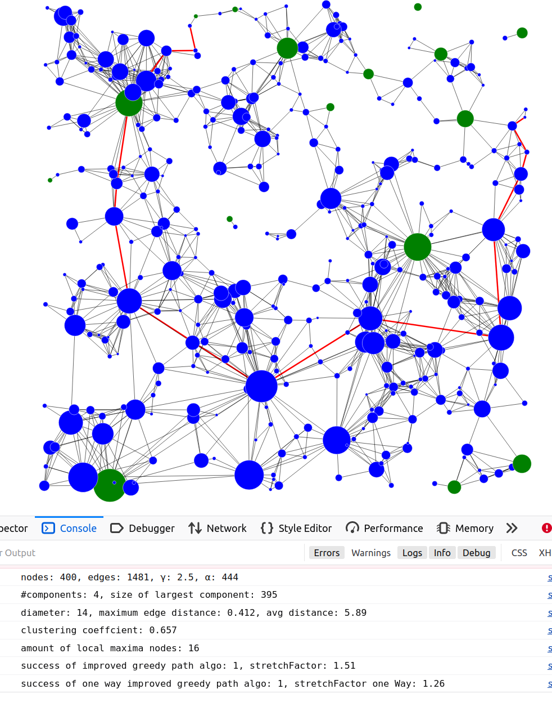
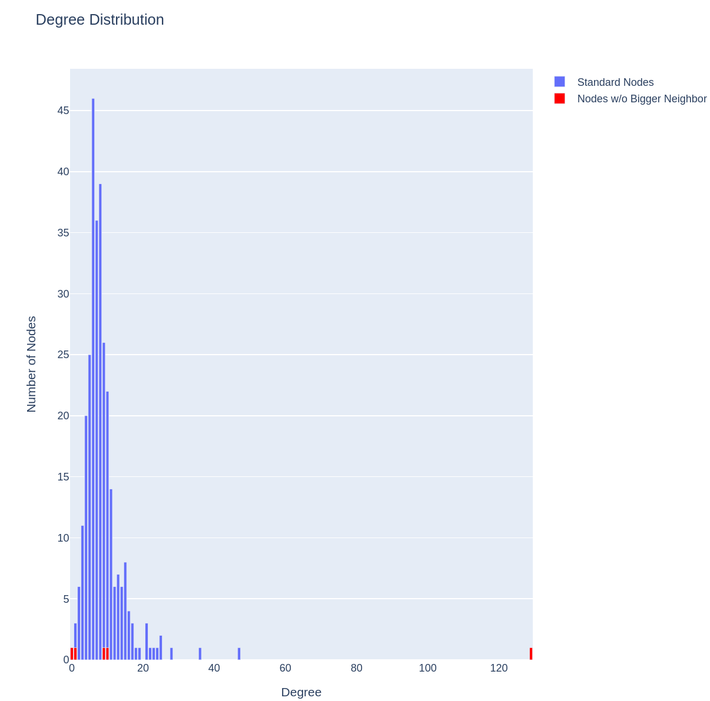

# Random Complex Graph Project

## Description

This project is an web application that allows users to generate and visualize Random Geometric Graphs (RGGs). Users can see how various parameters affect the graph's structure and properties. The application also provides detailed analysis of graph properties, including diameter, average distance, clustering coefficient, and more.

## Technologies

- Python 3.10.4
- Flask
- NetworkX
- Plotly
- JavaScript D3.js (for visualization)

## Installation

Ensure Python and Flask are installed on your system. Clone the repository and install the required Python packages:

```bash
git clone https://github.com/YourGithubUsername/RandomComplexGraph.git
cd RandomComplexGraph
pip install -r requirements.txt
```


Sicher, hier ist das README für Ihr Projekt in Englisch:

markdown
Copy code
# Random Complex Graph Project

## Description

This project is an interactive web application that allows users to generate and visualize Random Geometric Graphs (RGGs). Users can adjust various parameters to see how they affect the graph's structure and properties. The application also provides detailed analysis of graph properties, including diameter, average distance, clustering coefficient, and more.

## Technologies

- Python 3.10.4
- Flask
- NetworkX
- Plotly
- JavaScript D3.js (for visualization)

## Installation

Ensure Python and Flask are installed on your system. Clone the repository and install the required Python packages:

```bash
git clone https://github.com/YourGithubUsername/RandomComplexGraph.git
cd RandomComplexGraph
pip install -r requirements.txt
```

## Usage

Launch the application by running the app.py file:

```bash
python app.py
```

Then open your browser and go to http://localhost:5000 to use the application.

## Examples


Here the degree distribution from another random graph:

